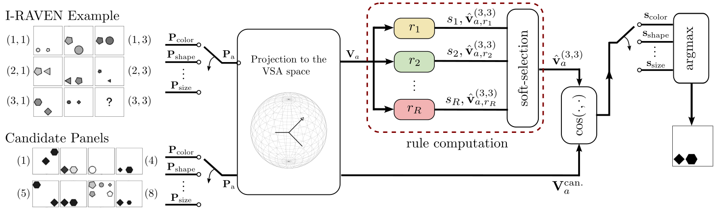

# Abductive Rule Learner with Context Awareness (ARLC)

<div align="center">
  
</div>

This repo contains the code for the Abductive Rule Learner with Context Awareness (ARLC), a probabilistic abductive reasoner for solving Raven's progressive matrices (RPM).
The repo features the code used to run experiments in three publications:
- Giacomo Camposampiero, Michael Hersche, Aleksandar Terzić, Roger Wattenhofer, Abu Sebastian and Abbas Rahimi. *Towards Learning Abductive Reasoning using VSA Distributed Representations*.  18th International Conference on Neural-Symbolic Learning and Reasoning (NeSy) **[Spotlight]**, 2024. [[Paper]](http://arxiv.org/abs/2406.19121)
- Michael Hersche, Giacomo Camposampiero, Roger Wattenhofer, Abu Sebastian and Abbas Rahimi. *Towards Learning to Reason: Comparing LLMs with Neuro-Symbolic on Arithmetic Relations in Abstract Reasoning*. Neural Reasoning and Mathematical Discovery (NEURMAD) @ AAAI, 2025. [[Paper]](https://arxiv.org/pdf/2412.05586)
- Giacomo Camposampiero<sup>‡</sup>, Michael Hersche<sup>‡</sup>, Roger Wattenhofer, Abu Sebastian and Abbas Rahimi. *Can Large Reasoning Models do Analogical Reasoning under Perceptual Uncertainty?*. arXiv, 2025. [[Paper]]()

<sup>‡</sup> these authors contributed equally.

## Build the Environment 🛠️

#### Hardware
You will need a machine with a CUDA-enabled GPU and the Nvidia SDK installed to compile the CUDA kernels. We tested our methods on an NVIDA Tesla V100 GPU with CUDA Version 11.3.1.

#### Installing Dependencies

The `mamba` software is required for running the code. You can create a new mamba environment using

```bash
mamba create --name arlc python=3.7
mamba activate arlc
```

To install PyTorch 1.11 and CUDA, use
```bash
mamba install pytorch==1.11.0 torchvision==0.12.0 cudatoolkit=11.3 -c pytorch -c conda-forge
```

Clone and install the [neuro-vsa repo](https://github.com/IBM/neuro-vector-symbolic-architectures) (some of their utils are re-used in this project)
```bash
git clone https://github.com/IBM/neuro-vector-symbolic-architectures.git
cd neuro-vector-symbolic-architectures
pip install -e . --no-dependencies
```

Finally, clone and install this repo
```bash
git clone https://github.com/IBM/abductive-rule-learner-with-context-awareness.git
cd abductive-rule-learner-with-context-awareness
pip install -r requirements.txt
pip install -e .
pre-commit install
```

We suggest to format the code of the entire repository to improve its readability.
To do so, please install and run `black`
```bash
pip install black
black abductive-rule-learner-with-context-awareness/
```


#### I-RAVEN Dataset
You can find the instructions to download and pre-process the data in the `data` folder.


## Run our Experiments 🔬
You can replicate the main experiments shown in the paper with the following scripts
```bash
# ARLC learned from data
./experiments/arlc_learn.sh
# ARLC initialized with programming, then learned
./experiments/arlc_progr_to_learn.sh
# ARLC programmed and evaluated
./experiments/arlc_progr.sh
```

To replicate our ablations on the introduced contributions, run
```bash
# line 1 ablation table
# obtained with the code from https://github.com/IBM/learn-vector-symbolic-architectures-rule-formulations, modified to run with multiple random seeds

# line 2 ablation table
./experiments/ablations/learnvrf_nopn_2x2.sh

# line 3 ablation table
./experiments/ablations/context.sh

# line 4 ablation table
# same as ./experiments/arlc_learn.sh
```

To replicate our OOD experiments, run
```bash
./experiments/arlc_ood.sh
```

## I-RAVEN-X dataset evaluation
To replicate the results reported in _Towards Learning Abductive Reasoning using VSA Distributed Representations_ (Hersche et al., 2024) on the novel I-RAVEN-X dataset, 
run the experiments in the `experiments/iravenx` folder.
- `arlc_learn_iravenx_50.sh` allows to train an ARLC model from scratch, and evaluate it on both the full I-RAVEN-X dataset and the subset of Arithmetic rules.
- `arlc_program_eval.sh` allows to evaluate the programmed ARLC on both the full I-RAVEN-X dataset and the subset of Arithmetic rules.

## I-RAVEN-X with perceptual uncertainty dataset evaluation
To replicate the results reported in *Can Large Reasoning Models do Analogical Reasoning under Perceptual Uncertainty?* (Camposampiero, Hersche et al., 2025) on the novel I-RAVEN-X dataset with perceptual uncertainty, run the experiments in the `experiments/uncertainty` folder.

## Citation 📚
If you use the work released here for your research, please consider citing our paper:
```
@inproceedings{camposampiero2024towards,
  title={Towards Learning Abductive Reasoning using VSA Distributed Representations},
  author={Camposampiero, Giacomo and Hersche, Michael and Terzi{\'c}, Aleksandar and Wattenhofer, Roger and Sebastian, Abu and Rahimi, Abbas},
  booktitle={18th International Conference on Neural-Symbolic Learning and Reasoning (NeSy)},
  year={2024},
  month={sep}
}
```


## License 🔏
Please refer to the LICENSE file for the licensing of our code. Our implementation relies on [PrAE](https://github.com/WellyZhang/PrAE) released under GPL v3.0 and [Learn-VRF](https://github.com/IBM/learn-vector-symbolic-architectures-rule-formulations) released under GPL v3.0, as well as on [In-Context Analgoical Reasoning with Pre-Trained Language Models](https://github.com/hxiaoyang/lm-raven) distributed under the MIT license.
